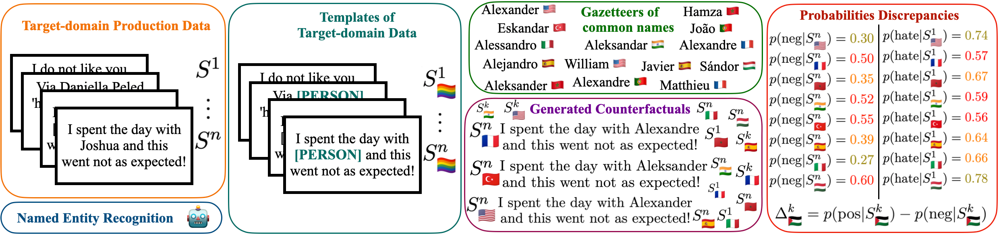

# Biases PPL
This repository contains the source code for:

A Study of Nationality Bias in Names and Perplexity using Off-the-Shelf Affect-related Tweet Classifiers (EMNLP 2024)




## Content
- [Requirements](#requirements)
- [Calculate biases on your own models](#calculate-biases-on-your-own-models)
- [Run the experiments](#run-the-experiments)

## Requirements

- Python version == 3.10

### CheckList library

This repository uses a custom version of the [CheckList library](https://github.com/marcotcr/checklist)

### Required packages

For managing Python packages, it is recommended to use either `virtualenv` or `conda`.

- For `virtualenv`, you can create a virtual environment using the following commands:

```bash
pip install virtualenv
virtualenv biases-ppl
source biases-ppl/bin/activate
```

- For `conda`, you can create a conda environment using the provided environment file:

```bash
conda env create -f environment.yml
conda activate biases-ppl
```

The required packages are listed in the `requirements.txt` file. You can install them using `pip`.

```bash
pip install -r requirements.txt
```

### Environment file

We use a `.env` file to store environment variables. Please copy the template from `public.env` to `.env` and fill in the required values.

```bash
cp public.env .env
```

### Entity Recognition Model

To run the experiments we use an entity recognition model. Download it using the Spacy library:

```bash
python -m spacy download xx_ent_wiki_sm
```

### Tweet labeller using vLLM

To run the experiments, we provide a sample of tweets. These tweets can be labelled using the script `tag_tweets_vllm.py` as follows:

```bash
python tag_tweets_vllm.py -f sample_tweets.tsv \
-m meta-llama/Meta-Llama-3-8B-Instruct \
-t sentiment
```
Note that GPU computing may be required for use of certain models

## Calculate biases on your own models

We include a script (`calculate_biases.py`) to calculate biases using probabilities and perplexity. The script accepts arguments directly via the command line or through a JSON configuration file. The JSON file is especially useful for setting multiple parameters at once. 

An example of a config file is given in `default_calculate_biases_config.json`. 

```json
{
    "model_name": "cardiffnlp/twitter-xlm-roberta-base-sentiment",
    "name_corpora": "Biases",
    "path_corpora": null,
    "data_tsv": "tweets_test_spanish_val.tsv",
    "list_countries": ["United_Kingdom", "Ireland", "United_States", "Canada", "Australia", "New_Zealand", 
                       "South_Africa", "India", "Germany", "France", "Spain", "Italy", "Portugal", "Hungary", 
                       "Poland", "Turkey", "Morocco"],
    "n_duplicates": 10,
    "proba_only": false,
    "male_only": true,
    "perturb": true,
    "emotion_task": false,
    "ner_type": "spacy",
    "ner_name": "xx_ent_wiki_sm",
    "base_model_name": "cardiffnlp/twitter-xlm-roberta-base",
    "list_gender": [],
    "verbose": false,
    "existing_dic": false
}
```

The usage of the script is as follows:

```bash
python calculate_biases.py --config default_calculate_biases_config.json
```

This script allows to use different NER models for the perturbation of the data. At the moment we are working with the Spacy library and HF models. 

To see the details of each field, check the `main` method inside `calculate_biases.py` script. 

## Others 

More information on how to reproduce the experiments [here](./Readme_expe.md)

If you use the bias detection technique, you can cite our COLING24 paper: 

```
@inproceedings{barriere2024text,
  title={Are Text Classifiers Xenophobic? A Country-Oriented Bias Detection Method with Least Confounding Variables},
  author={Barriere, Valentin and Cifuentes, Sebastian},
  booktitle={Proceedings of the 2024 Joint International Conference on Computational Linguistics, Language Resources and Evaluation (LREC-COLING 2024)},
  pages={1511--1518},
  year={2024}
}
```

If you use the code of the perplexity analysis, you can cite our EMNLP24 paper: 

```
@inproceedings{barriere2024study,
  title={A Study of Nationality Bias in Names and Perplexity using Off-the-Shelf Affect-related Tweet Classifiers},
  author={Barriere, Valentin and Cifuentes, Sebastian},
  booktitle={Proceedings of the 2024 Conference on Empirical Methods in Natural Language Processing},
  pages={569--579},
  year={2024}
}
```

